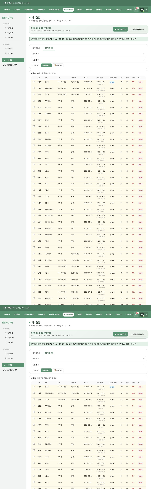
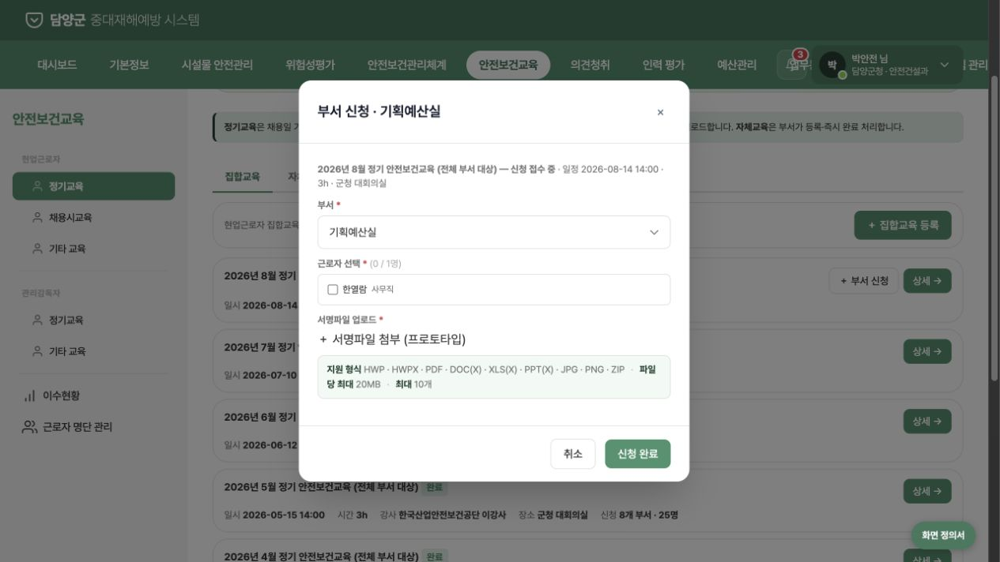
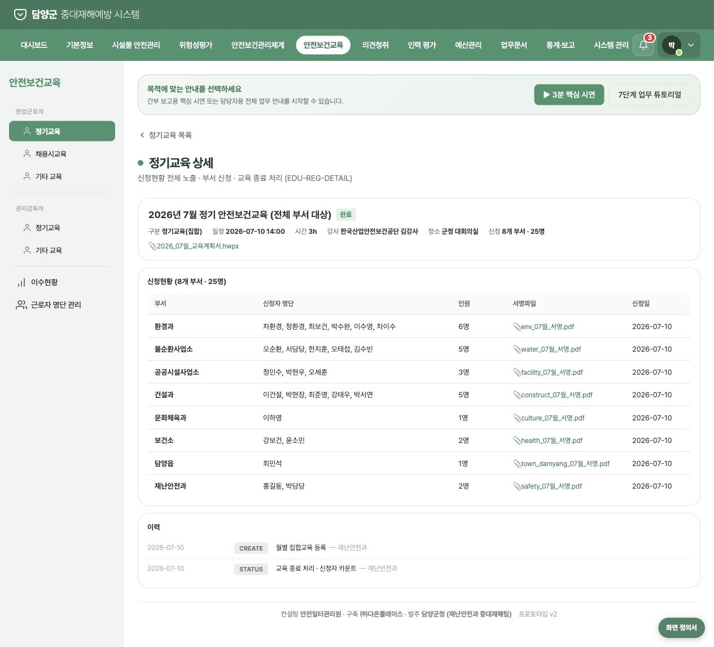
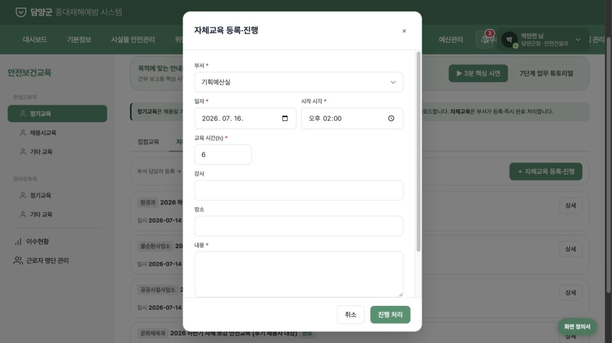
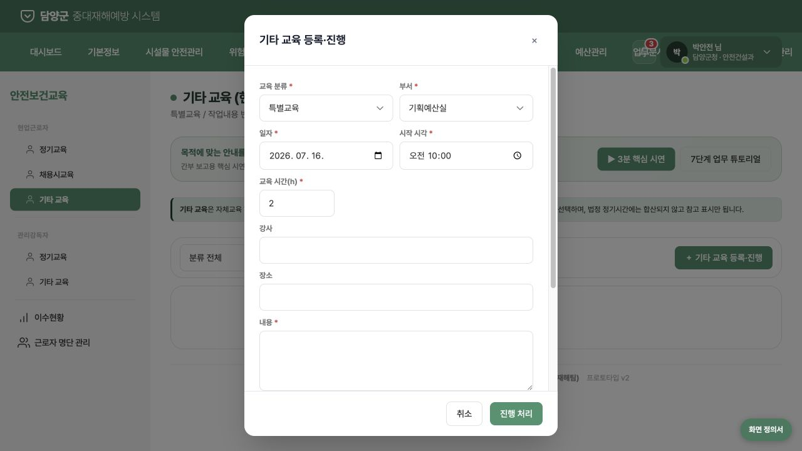

# 안전보건교육 관리 현실성·최소구현 검증

- 검증일: 2026-07-16
- 대상: 담양군 중대재해 통합관리 시스템 프로토타입 v2
- 범위: 근로자 명단 → 법정 필요시간 → 교육 등록·신청 → 실시·출석 → 증빙·이수 반영 → 미이수 조치 → 반기 점검·보고
- 방법: 화면 동작, 구현 코드, 내부 기획서, 현행 국가법령정보센터·고용노동부 자료 교차 검증

## 1. 최종 판정

**조건부 부적합 — UI 구조와 시연성은 양호하지만, 현재 상태를 실제 행정 절차가 성립하는 최소 프로토타입으로 보기는 어렵다.**

현재 프로토타입은 명단, 교육 분류, 이수현황, 독촉을 짧은 동선으로 묶었다는 점에서 방향은 좋다. 그러나 법정 기준 산정과 이수 확정 사이에 필요한 통제가 빠져 있어, 실제 운영 시 미참석자도 이수 처리되거나 법정 시간이 다른 교육이 동일하게 처리될 수 있다. 이 상태의 완료율은 고위 공무원 보고 지표로 사용하기 어렵다.

| 검증축 | 판정 | 요약 |
|---|---|---|
| 정보구조·메뉴 최소화 | 양호 | 핵심 메뉴는 이해하기 쉽고 중복이 과도하지 않음 |
| 간부 시연 직관성 | 양호 | 현황 → 미달 → 조치 흐름은 빠르게 이해 가능 |
| 법정 기준 산정 | 치명적 보완 필요 | 정기교육을 채용일 기준 개인별 6개월로 산정해 `매반기` 기준과 충돌 |
| 신청·출석·완료 현실성 | 치명적 보완 필요 | 신청 명단을 실제 참석 명단으로 간주해 전원 자동 카운트 |
| 자체·기타교육 증빙성 | 치명적 보완 필요 | 등록 즉시 완료되고 강사 자격·교육내용·증빙 검증이 없음 |
| 연계 현실성 | 보완 필요 | 인사연동·알림이 목업이며 동기화·실패·권한 상태가 없음 |
| 중대재해 관리 조치 | 누락 | 반기 점검·결과 보고·미이행 조치의 공식 상태가 없음 |

## 2. 현재 업무 흐름별 건강도

1. **근로자 명단 수집 — 주의**
   - 인사연동분 읽기 전용 + 계약직 직접등록·엑셀 업로드라는 최소 구성은 현실적이다.
   - 다만 마지막 동기화 일시, 실패·충돌, 퇴직·부서이동·수기 예외 상태가 없다.

2. **법정 교육 의무 산정 — 치명적**
   - 현 구현은 채용일을 시작점으로 개인마다 6개월 사이클을 반복한다.
   - 시행규칙 별표 4는 사무직·판매직 매반기 6시간, 그 밖의 근로자 매반기 12시간, 관리감독자 연간 16시간으로 정한다.
   - 내부 결정사항 문서도 채용일 기준의 법령 근거를 찾지 못했다고 기록했는데, 후속 재설계 문서에서 별도 법률 확인 없이 담양군 운영방침으로 확정했다.

3. **교육 계획·과정 등록 — 주의**
   - 일정·시간·강사·장소·내용·첨부의 기본 필드는 갖췄다.
   - 교육 내용의 법정 항목 적합성, 자체교육 강사 자격, 특별교육 대상 유해·위험작업과의 연결이 없다.

4. **부서 신청 — 치명적**
   - 미래 교육 신청 시 `서명파일`을 필수로 요구한다. 신청서와 참석 서명부의 의미가 혼재되어 있다.
   - 신청과 실제 참석을 분리하지 않아 불참·부분참석을 표현할 수 없다.

5. **교육 실시·출석 확인 — 누락**
   - 개인별 참석/불참, 실제 시작·종료 시각, 부분 이수, 출석 확인자가 없다.
   - 실제 행정에서 이수 인정의 핵심 단계가 화면과 데이터 모두에 없다.

6. **결과 확정·이수시간 반영 — 치명적**
   - 집합교육 종료 시 모든 신청자에게 전 시간이 자동 반영된다.
   - 자체교육과 기타교육은 등록 버튼이 곧 완료 처리이며 증빙 첨부도 필수가 아니다.
   - 수정·취소·정정 사유와 승인 이력이 없어 감사 대응이 어렵다.

7. **채용 시 교육 — 주의**
   - 계약기간별 1/4/8시간 자동 산정은 현행 별표 4와 맞는다.
   - 그러나 과거 채용자 다수가 계속 미이수로 표시되고, 일괄 처리에서 실제 증빙 없이 채용일로 소급 완료할 수 있다. 도입 기준일과 기존 이력 이관 규칙이 필요하다.

8. **미이수 독촉 — 주의**
   - 대상 선택, 부서별 발송, 이력 기록은 최소 기능으로 적절하다.
   - 실제 연계에는 수신 부서·담당자, 전달 성공/실패, 조치기한, 처리상태가 필요하다. 회신 기능은 후순위로 미뤄도 된다.

9. **반기 점검·보고·조치 — 누락**
   - 중대재해처벌법 시행령 제5조의 반기 점검, 결과 보고, 미실시 교육에 대한 이행 지시·예산 확보 상태가 없다.
   - 현재 `독촉`만으로는 경영책임자 관점의 관리 조치 증빙이 완성되지 않는다.

10. **튜토리얼·간부 시연 — 주의**
    - 3분 핵심 시연과 7단계 튜토리얼의 표현과 조작은 직관적이다.
    - 다만 현재의 잘못된 사이클과 자동 이수 흐름을 그대로 안내하므로, 핵심 로직 수정 후 시연 문구도 함께 바꿔야 한다.

## 3. 화면 증거

### 개인별 채용일 기준 사이클

### 미래 교육 신청 단계에서 서명파일 필수

### 신청 명단만 표시되고 참석 상태가 없는 완료 상세

### 자체교육이 등록 즉시 완료되는 입력 화면

### 특별·작업변경 등 서로 다른 교육이 동일한 2시간 폼을 사용

## 4. 법령 대조

- 산업안전보건법 제29조는 정기교육, 채용·작업변경 시 교육, 유해·위험작업 특별교육을 구분한다.  
  https://www.law.go.kr/LSW/lsLinkCommonInfo.do?lsJoLnkSeq=1032635509
- 시행규칙 제26조는 교육시간·내용을 별표 4·5에 따르도록 하고 자체교육 강사 자격을 제한한다.  
  https://www.law.go.kr/lsLinkCommonInfo.do?lsJoLnkSeq=1016499401
- 별표 4는 정기교육 `매반기 6/12시간`, 관리감독자 `연간 16시간`, 채용 시 `1/4/8시간`, 작업변경 `1/2시간`, 특별교육 `2/8/16시간` 등 서로 다른 기준을 둔다.  
  https://www.law.go.kr/LSW/flDownload.do?bylClsCd=110201&flSeq=156779109&gubun=
- 중대재해처벌법 시행령 제5조는 유해·위험작업 교육 실시 여부를 반기 1회 이상 점검하고, 미실시 시 이행 지시·예산 확보 등 조치를 요구한다.  
  https://law.go.kr/lsLinkCommonInfo.do?chrClsCd=010202&lsJoLnkSeq=1017000105
- 고용노동부 FAQ는 자체교육 후 교육일지를 작성·보존하도록 안내한다.  
  https://www.moel.go.kr/faq/faqView.do?seqRepeat=521

## 5. 실제로 필요한 최소 기능

화면을 크게 늘리지 않고 아래 7개 상태만 성립시키면 된다.

1. **대상자 원장**: HR 1방향 연계/엑셀 + 수기 예외, 마지막 동기화·오류 표시
2. **법정 의무 규칙**: 역법상 반기/연간 + 채용·작업변경·특별교육별 시간·기한
3. **교육 계획**: 과정 분류, 대상 작업, 일시, 내용, 강사와 자격 근거
4. **대상자 배정/신청**: 신청자 명단만 관리; 서명은 이 단계에서 받지 않음
5. **실시 결과**: 개인별 참석·불참·부분이수 + 교육일지·서명부·교재
6. **이수 원장**: 결과 확정 후 참석자에게만 시간 반영; 정정 사유와 변경 이력
7. **반기 점검·조치**: 미이수 확인 → 부서 통보 → 조치기한 → 완료/미완료 → 보고

## 6. 최소 연계 범위

| 연계 | MVP에 필요한 수준 | 지금 미뤄도 되는 것 |
|---|---|---|
| 인사 | 근로자 원장 1방향 동기화 또는 정기 엑셀 반입, 마지막 성공/오류 | 실시간 양방향 인사 수정 |
| 인증·권한 | 재난안전과 교육관리자 / 부서담당자 최소 2역할, 행위 제한 | 복잡한 다단계 결재 |
| 파일 | 교육일지·서명부·교재 저장, 파일 메타데이터와 과정 연결 | OCR·전자서명 |
| 알림 | 부서 담당자 1방향 통보, 성공/실패·발송시각 | 채팅·회신·다채널 캠페인 |
| 보고 | 반기 점검 결과와 조치현황 화면/PDF 또는 엑셀 | BI·고급 통계 플랫폼 |

별도 LMS, 온라인 강의, 정원·대기열, 캘린더 API, 복잡한 승인선은 현재 MVP에 필요하지 않다.

## 7. 수정 우선순위

### P0 — 간부 시연 전에 반드시

1. 정기교육 기준을 역법상 반기(1~6월/7~12월)와 연간으로 재설계하고 신규 채용 반기 처리 원칙을 노무·법률 검토로 확정
2. 신청과 참석을 분리하고 개인별 참석자만 이수 반영
3. 서명파일을 신청 단계가 아닌 결과 확정 단계로 이동
4. 자체·기타교육의 `등록 즉시 완료` 제거; 강사 자격·교육내용·증빙 확인 후 완료
5. 특별·작업변경·채용 시 교육을 교육유형별 시간·대상·실시시점 규칙으로 분리
6. 반기 점검·결과보고·미이행 조치 상태 추가

### P1 — 실제 사용자 검증 전에

1. 중앙관리자/부서담당자 권한 분리
2. HR 동기화 시각·오류·퇴직·부서이동·이관 규칙
3. 알림 전달 성공/실패와 조치기한
4. 이수 정정·취소 사유와 변경 이력

### P2 — 후속 고도화

1. 담당자 회신
2. 정원·마감·대기열
3. 온라인 교육/LMS 연계
4. 전자결재·고급 통계

## 8. 증거 한계

- 본 검증은 정적 프로토타입과 브라우저에서 노출되는 상태, 클라이언트 코드, 공개 법령 자료를 기준으로 했다.
- 실제 담양군 내부 인사시스템, 전자결재, 기록물 보존 규정, 직종별 현업업무종사자 지정명단은 확인하지 못했다.
- 신규 채용자가 입사한 반기의 정기교육 산정, 감면 적용, 공무원·현업업무종사자 적용범위는 담양군 노무·법률 담당 확인이 필요하다.
